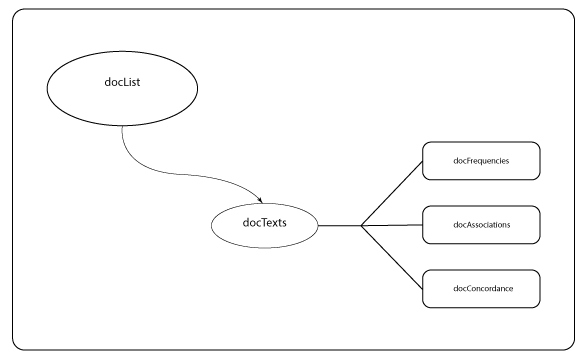

# Introduction
****
Welcome to the tei2r package.  You'll be creating a lot of objects using this package, including:  
     
  - a `docList` object.  
  - a `docFrequencies` object.  
  - a `docAssociations` object.  
  - a `docConcordance` object.  
  - a `docTexts` object.  

Managing all of these can get a bit complex.  This document is designed to help you develop strategies for keeping track of all of your objects, beginning with an admittedly simplistic acronym __FACT__.
  

## FACT

After you've created your `docList` object, which is the foundation of the `tei2r` package, you'll need to make sure you get all the __FACT__s about your corpus together.  That is, you'll need:  

  - __F__requencies  
  - __A__ssociations  
  - __C__oncordances  
  - __T__exts  
  
You'll want to begin with your `docTexts` object since it is necessary for the calculation of term frequencies, associations, and concordances (you can't find out how many times a word occurs in a text without the text, can you?).  Many of the other objects are heavily depended or build upon each other.  We suggest that you build your remaining objects in the following order:  

  1. `docFrequencies` (requires `docTexts` object).
  1. `docConcordance` (requires `docTexts` object).
  1. `docAssociation` (requires `docFrequencies` and `docConcordance` objects).

Having created these objects, you'll have everything you need (the facts, if you will) to work with your corpus of texts.

## Naming Conventions

We recommend a fairly simple naming scheme: `d<letter>` where <letter> is the part of __FACT__ the object represents.  For example, `df` would be the `docFrequencies` object for my collection.

***
## Parts of the Objects

Remembering which objects have which parts can also be overwhelming.  Below you'll find a reference sheet for the parts of the __FACT__ set of objects.  Every object will have a reference to the `directory` and `indexFile` that was used to create it.  This aids in keeping track of which objects are related to which corpus.

Each object includes `slots` or named items that store various pieces of informaiton.  To access any of these `slots`, use the `<variable name>@<slot name>`.  For example: `df@raw` would be a reference to my `docFrequencies` object's `raw` slot which houses a list of the frequency of a term's use in each document in my corpus. (I could access the frequency of all terms in the first document by using `df@raw[1]`)^[Items marked with an <span style="color: red">*</span> are optional parts of these objects.]

### F
The `docFrequencies` object is an object that houses the basic frequency information for terms across your corpus.  The `docFrequencies` object includes several `slot`s or fields of informaiton.  These are:  

  - `directory` a string that gives the full path to the main directory (folder) that houses your corpus of texts.
  - `indexFile` a string that gives the full path to the file that contains your index file (the meta-data for your corpus).
  - `raw` a list of the raw frequencies of each term in each document in your corpus.
  - `proportional` a list of the proportional frequency of each word in each document.  That is, the calculation of the frequency of `x` term's appearance in each document divided by the total number of words in the document. (`f(x)/total(document)`)
  - `vocabulary`<span style="color: red">*</span> a list of the raw frequencies of each term in the whole corpus.
  - `proportionalVocab`<span style="color: red">*</span> a list of the proportional frequencies of each term across the whole corpus.  That is, the calculation of the frequency of `x` term's appearance in the whole corpus divided by the total number of words in the document. (`f(x)/total(corpus)`)^[This calculation can take a very long time depending on the size of your corpus.]
  
### A
The `docAssociations` object houses the frequency information for words associated with a particular `term` across your corpus.  It's `slot`s are:  

  - `directory` a string that gives the full path to the main directory (folder) that houses your corpus of texts.
  - `indexFile` a string that gives the full path to the file that contains your index file (the meta-data for your corpus).
  - `term` a string that retains the term that was used to create the `docConcordance` object.  This is also the term that the associated words in this object are associated with.
  - `context` a number that retains the context (the number of words on each side of `term` that were sampled when developing a concordance) that was used when creating the `docConcordance` object.
  - `associations` a list that contains the frequencies of the words that are associated with `term` for each document.  The number of elements in this list will be equal to the number of documents in your corpus.
  - `proportions` a list that contains the proportional frequency of the words associated with `term`. This is derived by determining the ratio of the words appearance with `term` to its proportional frequency across the whole document.  This calculation enables an assessment of the importance of the word's co-occurrance with `term` in the document.  Exceedingly high values, for example, likely indicate that the word only appears with `term` in the document. The number of elements in this list will be equal to the number of documents in your corpus.
  
### C
The `docConcordance` object holds the concordance for one term accross the corpus.  If you want to find the concordance of more than one term, you will need to have multiple concordance objects.  Fortunately, the `docConcordance` and `docAssociations` objects each retain the `term` used to create them, so keeping track of which object is which is simpler.  Its `slots` are:  

  - `directory` a string that gives the full path to the main directory (folder) that houses your corpus of texts.
  - `indexFile` a string that gives the full path to the file that contains your index file (the meta-data for your corpus).
  - `term` a string that holds the desired word to find the concordance of.
  - `context` the number of words on each side of the term with which to build the concordance (`[-context]X[+context]`). Take, for example, the sentence: "Jack runs faster than Jane does sometimes." If we had `context=2` and `term = "than"`, the return would be `["runs", "faster", "than", "Jane", "does"]` (`[-2]than[+2]`).
  - `concordance` a list of concordances for `term` at `context` in each document.  The number of elements in this list will equal the number of documents in your corpus.
  
### T
The `docTexts` object holds all of the (cleaned)^[The full text minus any stopwords.] text for each document in your corpus.  Its `slots` are:

  - `directory` a string that gives the full path to the main directory (folder) that houses your corpus of texts.
  - `indexFile` a string that gives the full path to the file that contains your index file (the meta-data for your corpus).
  - `text` a list of the text of each document in your corpus.  The length of this list will equal the number of documents in your corpus.

## The Structure

  
The object structure of the `tei2r` package.

## An Example Creation Script
```r
dl = buildDocList(directory = "~/Desktop/Grad School/R Project 15/data/testCaseThree/", 
    stopwordsFile = "~/Desktop/Grad School/R Project 15/data/stopword_list.txt", 
    indexFile = "~/Desktop/Grad School/R Project 15/data/testCaseThree/index.csv")

# Build the docTexts object
dt = getTexts(dl)

# Build the docFrequencies object
df = getFrequencies(dt)

# Build the docConcordance object
dc = getConcordance(dt, term = "just", context = 5)

# Build the docAssociations object
da = getAssociations(dc, df)

# Now I have all of my FACTs, I can do some investigation!

```
